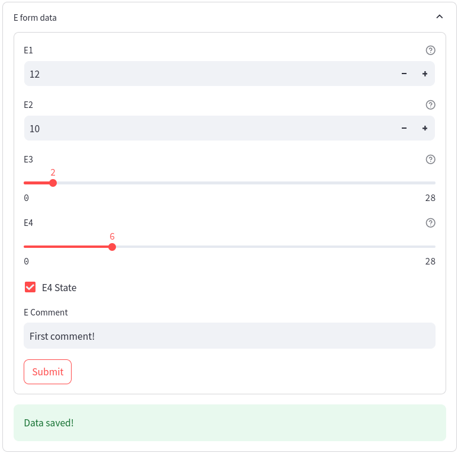
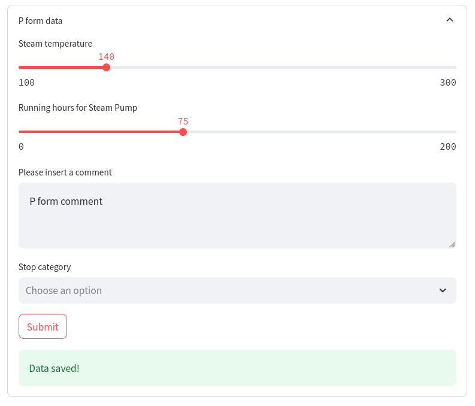
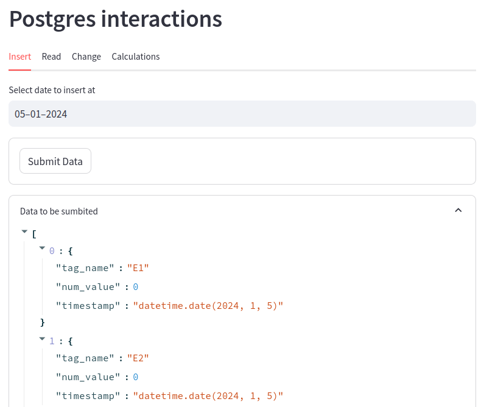
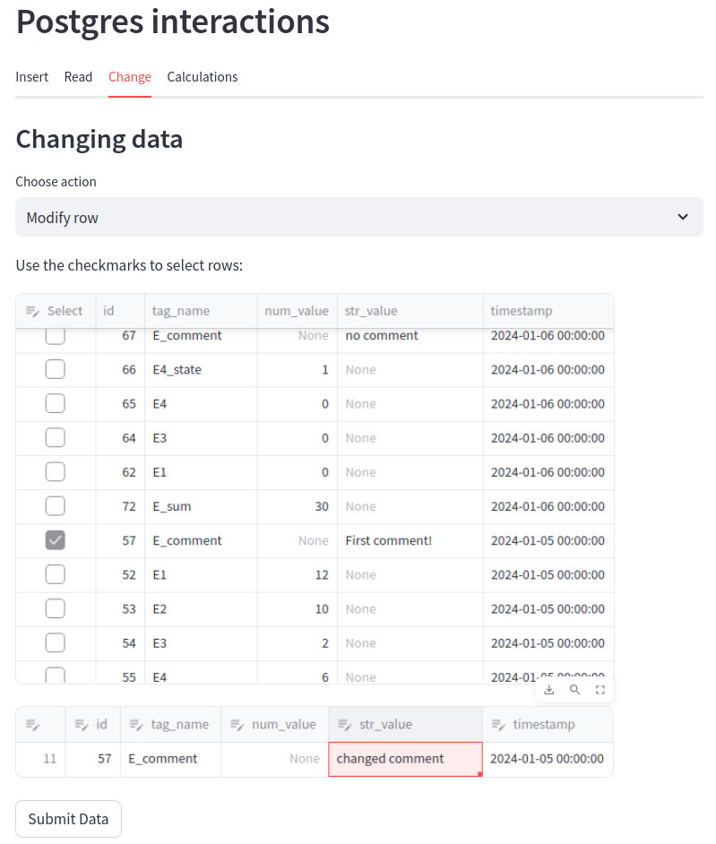
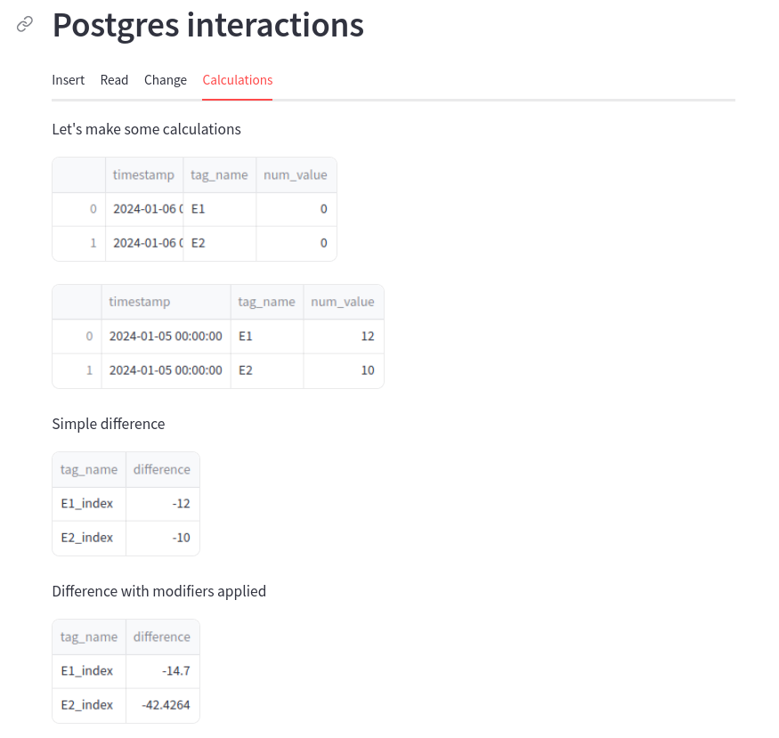
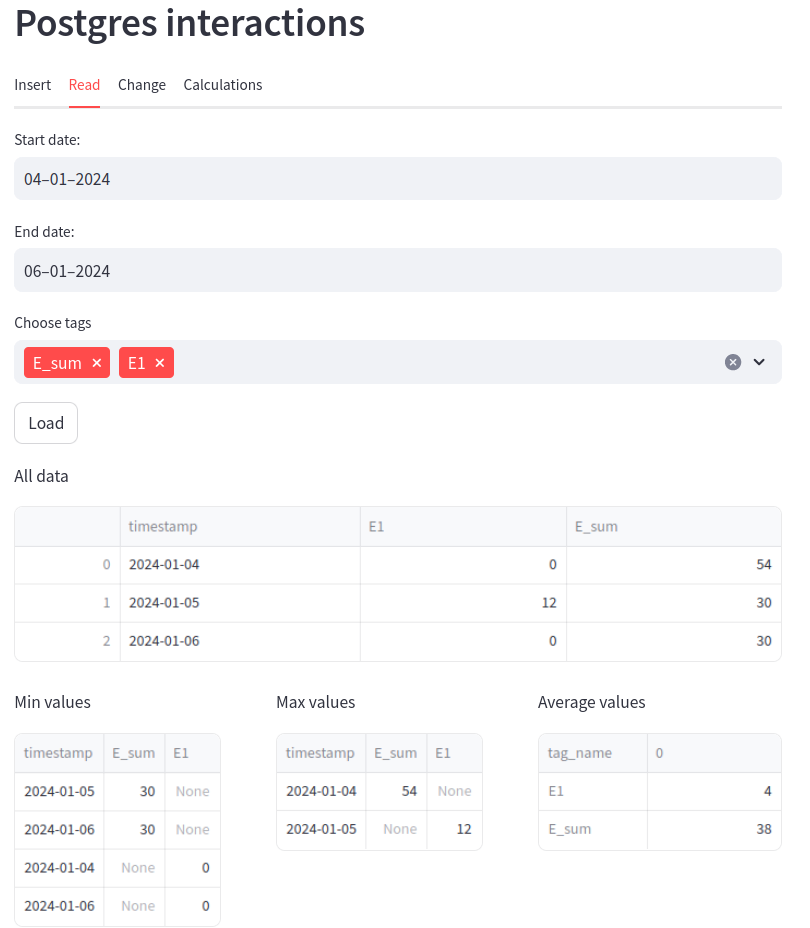
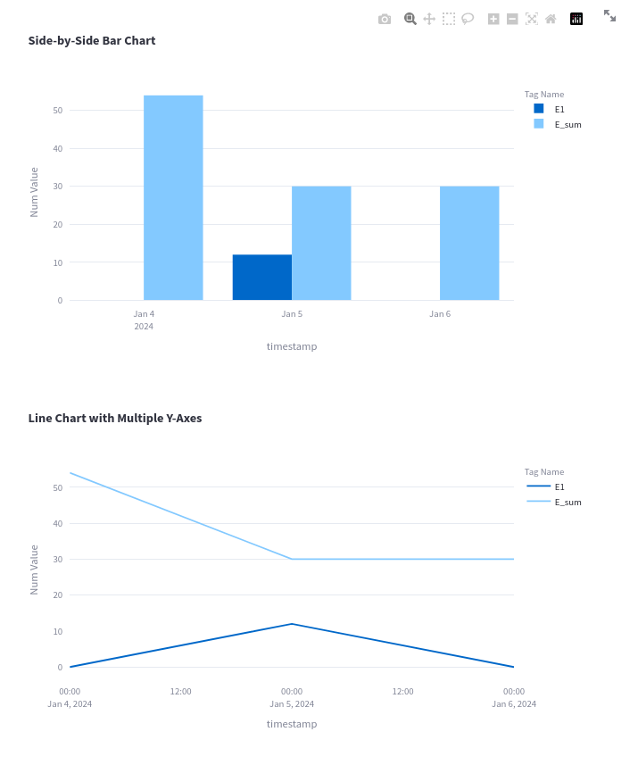
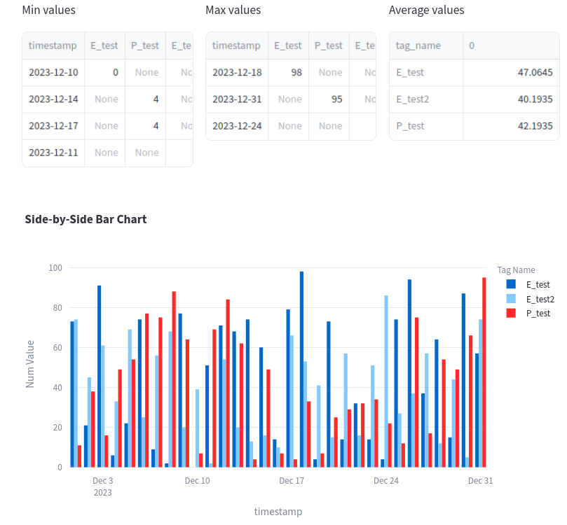
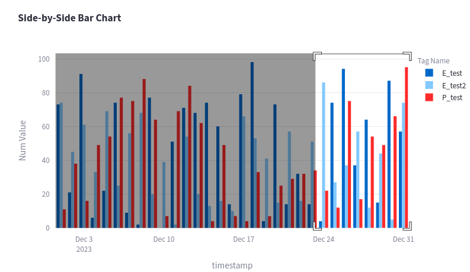
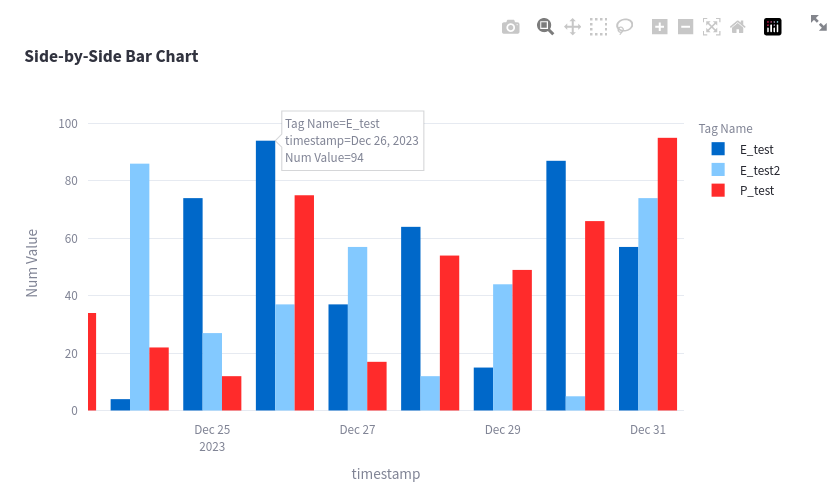

# python_streamlit_postgresql
This is a demo application using streamlit for creating Forms (example using [streamlit-pydantic](https://github.com/LukasMasuch/streamlit-pydantic) and manual definitions). Form data may be used in other calculations too. Inspired by a real world project and also [Sven-Bo tutorials](https://github.com/Sven-Bo/google-sheets-data-entry-form-with-streamlit/blob/main/vendor_app.py).

After forms are filled in, the operator may:
- insert the form data into Postgresql at a given date
- modify or delete rows insert previously
- read data to gain insights

## Setup
### Postgresql
I opted for Postgresql instead of a simpler sqlite, because of production reasons and need to add Timescale later.

#### Docker
For the sake of this demo you can simply use the following docker command; feel free to use dockercompose instead.
```sh
docker run --name postgres -it -p 5432:5432 -e POSTGRES_USER=postgres_user -e POSTGRES_PASSWORD=postgres_password -e POSTGRES_DB=myDataBase postgres
```

Then, you need access to the psql cli:
```sh
docker exec -it postgres psql -U postgres_user -d myDataBase
```

If you see this, everything is good:
```
psql (16.1 (Debian 16.1-1.pgdg120+1))
Type "help" for help.

myDataBase=#
```

You can stop the docker container with this command. Replace "stop" with "start" if you want to start it again.
```sh
docker stop postgres
```

#### Tables
For this demo, I used one simple table. You can create it in psql with this command:
```sql
CREATE TABLE my_table (
        id BIGSERIAL PRIMARY KEY,
        tag_name VARCHAR(80) NOT NULL,
        num_value INTEGER,
        str_value VARCHAR,
        timestamp timestamp DEFAULT (CURRENT_TIMESTAMP) NOT NULL
);
```

The `postgresql_definitions.py` is used for SQLAlchemy.

### Python 
Install the requirements from the requirements.txt file.

For streamlit to be able to connect to Postgresql, you need to make `.streamlit/secrets.toml` file. For the sake of this demo, the file would look like this:
```
[connections.postgresql]
dialect = "postgresql"
host = "localhost"
port = "5432"
database = "myDataBase"
username = "postgres_user"
password = "postgres_password"
```

Then run the streamlit app with:
```sh
streamlit run main.py
```

## Showcase
The forms are used to insert data:



Then, we can insert the data at some given date:


After some inserts data may look like this:
```
myDataBase=# select * from my_table;
 id |     tag_name      | num_value |   str_value    |      timestamp      
----+-------------------+-----------+----------------+---------------------
 42 | E1                |         0 |                | 2024-01-04 00:00:00
 43 | E2                |         0 |                | 2024-01-04 00:00:00
 44 | E3                |         0 |                | 2024-01-04 00:00:00
 45 | E4                |         0 |                | 2024-01-04 00:00:00
 46 | E4_state          |         1 |                | 2024-01-04 00:00:00
 47 | E_comment         |           | no comment     | 2024-01-04 00:00:00
 48 | FIQ               |       130 |                | 2024-01-04 00:00:00
 49 | FIQ_running_hours |        83 |                | 2024-01-04 00:00:00
 50 | P_comment         |           | no comment     | 2024-01-04 00:00:00
 51 | E_sum             |        54 |                | 2024-01-04 00:00:00
 52 | E1                |        12 |                | 2024-01-05 00:00:00
 53 | E2                |        10 |                | 2024-01-05 00:00:00
 54 | E3                |         2 |                | 2024-01-05 00:00:00
 55 | E4                |         6 |                | 2024-01-05 00:00:00
 56 | E4_state          |         1 |                | 2024-01-05 00:00:00
 57 | E_comment         |           | First comment! | 2024-01-05 00:00:00
 58 | FIQ               |       140 |                | 2024-01-05 00:00:00
 59 | FIQ_running_hours |        75 |                | 2024-01-05 00:00:00
 60 | P_comment         |           | P form comment | 2024-01-05 00:00:00
 61 | E_sum             |        30 |                | 2024-01-05 00:00:00
(20 rows)
```

I have also made a page where we can modify or delete rows as well:


Finally, this data can be read to perform some calculations such as getting the delta between 2 days, or more complicated calculations:


... or the data can be used to calculate min, max, mean or be displayed on graphs (using plotly):




### More data

Using the following query, I can insert dummy data, to showcase how the graphs may look with more data points.
```SQL 
INSERT INTO my_table (tag_name, num_value, timestamp)
SELECT
    'E_test' AS tag_name, -- Change if desired
    floor(random() * 100) AS num_value, -- Adjust the range as needed
    generate_series(
        '2023-12-01'::timestamp,
        '2023-12-31'::timestamp,
        '1 day'::interval
    )::date AS timestamp;
```

Then these tags can be selected in the streamlit interface. **Note**: connection can last a few minutes, so you may have to reload the session to force requery tag_names.


Note that plotly graphs can be zoomed in and out!




### Performance 
Inserting a `Performance_test` tag between 2023-01-01 to 2023-12-31 at 1 minute intervals, results into `524161` new rows added to Postgresql.

```SQL 
myDataBase=# explain select * from my_table where tag_name='Performance_test';
                            QUERY PLAN                            
------------------------------------------------------------------
 Seq Scan on my_table  (cost=0.00..10922.56 rows=524180 width=68)
   Filter: ((tag_name)::text = 'Performance_test'::text)
(2 rows)
```

Streamlit page loads are rather fast, lower than 3 seconds (worst case).

This query could be improved by adding an index to the table.
